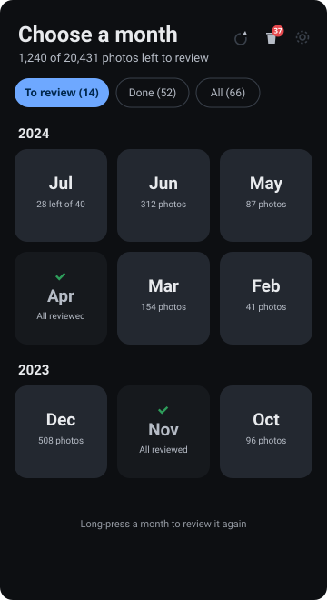
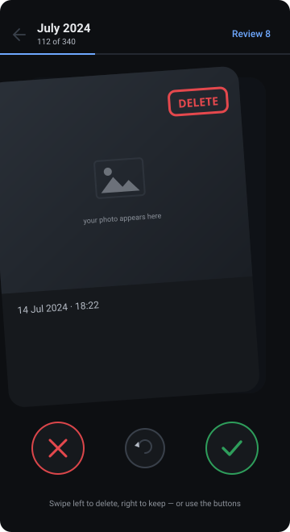
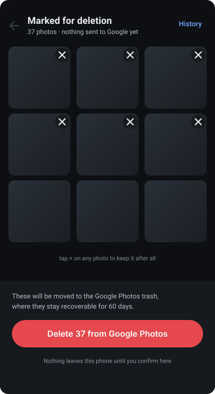

# Photo Cleaner

An Android app for going through your Google Photos library one photo at a time,
month by month, keeping or deleting each one. Deletions are real — they move to the
Google Photos trash, not just off the phone.

Nothing is stored on a server. There is no backend, no account, and no analytics.

---

## Interface

> These are **illustrations of the layout**, not real screenshots. The app sets
> `FLAG_SECURE` so a photo library cannot be captured, which makes screenshots come
> out blank — turn on **Settings → Allow screenshots** to take real ones.

| Pick a month | Review one at a time | Confirm before anything happens |
|---|---|---|
|  |  |  |
| Filtered to what still needs work. Finished months move to **Done**, where a long-press reopens one. | Swipe left to delete, right to keep. Videos play in place. Undo steps back. | Verdicts stay on the phone until you confirm here. Trashed photos are recoverable for 60 days. |

## Why it is built this way

The obvious approach — the official Google Photos API — cannot do this job.

On **31 March 2025** Google removed the `photoslibrary.readonly`, `photoslibrary`
and `photoslibrary.sharing` scopes. Calls using them now return `403 PERMISSION_DENIED`.
What remains cannot do any of the following:

| What you need | Official API |
|---|---|
| List your library | Not possible — apps only see media they created themselves |
| Filter by month | Not possible — there is nothing to filter |
| Delete a photo | **Never existed.** No delete endpoint has ever been offered |
| Move a photo to an album | `batchAddMediaItems` only works on items *your app* uploaded |

The replacement Picker API returns only items you hand-pick in Google's own UI, and
exposes just `id`, `createTime`, `type` and `mediaFile` — not even a `productUrl` to
link back to the photo.

So this app does what the browser extensions in this space do: it drives the same
internal `batchexecute` API that `photos.google.com` itself uses.

### It embeds a real browser rather than imitating one

Android's WebView is the same Chromium engine as Chrome. The app loads the genuine
`photos.google.com`, you sign in on Google's own page, and every API call is issued
**from inside that page** via `fetch(..., { credentials: 'include' })`.

The practical result is that requests are not *disguised* as browser traffic — they
are browser traffic, from your own authenticated session, with the same rpcids and
payloads Google's own front-end sends. There are no forged headers to be caught out by.

A deliberately rejected alternative was impersonating the Google Photos **Android
app** via `photosdata-pa.googleapis.com`. It would look native, but it requires a
*master token* (`aas_et/…`) — the credential that unlocks the entire Google account,
Gmail and Drive included — plus a forged `client_sig`/`callerSig`. Storing that on a
phone is far more dangerous than a Photos web cookie, and a master token from an
unrecognised device fingerprint is a textbook account-compromise signal.

---

## Security design

The central design rule: **the app never stores a Google credential, and every API
call is made by the page rather than by app code.**

Session cookies live in the WebView's own cookie jar. They are never copied into app
storage, never written to the database, and never logged. All Google API traffic is
issued from inside the page's own origin, so the app can ask for named operations and
receive parsed results without ever handling a token.

**One deliberate exception, worth knowing about.** Photo thumbnails on
`lh3.googleusercontent.com` are private to the account — a browser loads them only
because it attaches the session cookie automatically. To render them the image loader
reads the cookie from the WebView jar at request time and sends it straight to Google,
for Google hosts only ([`App.kt`](app/src/main/java/xyz/photocleaner/App.kt)). Nothing
is retained. This narrows the original guarantee and is called out here rather than
buried: without it, every photo renders as a blank card.

| Measure | Where |
|---|---|
| Bridge scoped to `https://photos.google.com` only, via `addWebMessageListener` | `session/GPhotosSession.kt` |
| Navigation allowlist — the WebView refuses non-Google hosts | `GPhotosSession.isAllowedHost` |
| Decisions stored in SQLCipher, key in Android Keystore (StrongBox where available) | `security/DatabaseKeyProvider.kt` |
| `FLAG_SECURE` — no screenshots, screen recording, or recents thumbnail | `MainActivity.kt` |
| Optional biometric / device-credential lock | `MainActivity.promptUnlock` |
| Cleartext traffic denied; **user-installed CAs not trusted** (defeats proxy interception) | `res/xml/network_security_config.xml` |
| No cloud backup, no device-to-device transfer | `res/xml/data_extraction_rules.xml` |
| Logging stripped from release builds | `proguard-rules.pro` |
| Cookie forwarded to Google image hosts only, at request time, never stored | `App.kt` |
| WebView renderer death handled, so a killed render process cannot take the app down | `session/GPhotosSession.kt` |

The APK declares exactly one meaningful permission — `INTERNET`. Verified against the
built release APK:

```
android.permission.INTERNET
android.permission.USE_BIOMETRIC
android.permission.USE_FINGERPRINT
```

No storage access, no account access, no location.

---

## How it works

1. **Sign in** — Google's own login page inside the WebView. The app has no login form.
2. **Pick a month** — the library timeline is scanned and grouped by date taken.
   Counts stream in as pages arrive, so recent months appear within seconds.
3. **Swipe** — one photo at a time. Right keeps, left deletes; buttons do the same,
   and undo steps back. Verdicts are written locally and **nothing is sent to Google**.
4. **Review and commit** — the only screen that changes your account. You see
   everything marked for deletion, can pull individual photos back out, then confirm.
5. **Undo** — trashed items stay restorable from the History tab for 60 days.

### Two deletion modes

- **Move to trash** (default) — a real deletion. Recoverable for 60 days, after which
  the storage is freed.
- **Collect in an album** — deletes nothing, gathers the photos into a "To Be Deleted"
  album so you can check them in Google Photos and delete them yourself.

---

## Risks, stated plainly

**This uses undocumented Google endpoints, which is against the Google Photos terms
of service.** It is your own account and your own photos, and it is the same mechanism
used by extensions with [9,000](https://github.com/Kirstihly/Google-Photos-Delete-Tool)
and [10,000](https://chromewebstore.google.com/detail/delete-all-google-photos/bebhhjmapjadpdkkhbkpnpbjhkhndofl)
users. There are no documented reports of account bans for this, and Google's observed
response has been to break such tools rather than penalise accounts.

That is not a guarantee. Account action is at Google's discretion. The realistic
failure modes are:

- **Rate limiting** (HTTP 429) or a temporary block. `api/Pacer.kt` exists to avoid
  this: jittered gaps between calls, batches capped at 50, and an exponential cooldown.
- **The app breaking.** Google can change the rpcids at any time. The parser is written
  so a shape change degrades to a dropped field or a skipped item — never a wrong
  `dedupKey`, which is what deletion acts on.

**Before any bulk delete, run a [Google Takeout](https://takeout.google.com) export.**
Trash is recoverable for 60 days, but a real backup is the actual safety net.

---

## Building

Requires JDK 17+ and the Android SDK (compileSdk 35).

```bash
./gradlew :app:assembleDebug          # installable, signed with the debug key
./gradlew :app:testDebugUnitTest      # 13 parser tests
./gradlew :app:assembleRelease        # unsigned; sign before installing
```

Install the debug build:

```bash
adb install app/build/outputs/apk/debug/app-debug.apk
```

The release APK is unsigned. To install it, sign it with your own key:

```bash
keytool -genkey -v -keystore my.keystore -alias photocleaner \
        -keyalg RSA -keysize 2048 -validity 10000
apksigner sign --ks my.keystore --out signed.apk \
        app/build/outputs/apk/release/app-release-unsigned.apk
```

Minimum Android 8.0 (API 26).

---

## Signing

The signing key is the app's permanent identity. Android accepts an update only if
it is signed by the same key as the installed version, so **losing the key means you
can never update the app again** — existing users would have to uninstall and lose
their local data. There is no recovery process.

### Generate it (once)

```bash
./tools/make-keystore.sh
```

You will be prompted for a password and certificate details. Both are permanent:
the password cannot be reset, and the certificate fields cannot be edited later.

PKCS12 keystores use a single password for the store and the key, so
`KEYSTORE_PASSWORD` and `KEY_PASSWORD` below take the same value.

### Back it up

Losing this file is unrecoverable, so keep more than one copy, in more than one place:

- **A password manager** — store the `.jks` as a file attachment alongside the
  password. This is the single most useful copy, because the file and the password
  it needs stay together.
- **An offline copy** — a USB drive or printed base64 in a safe. Anything that
  survives losing this machine and your cloud accounts at the same time.
- **Not** in the repository, not in a public cloud folder, not in a chat message.

Also record the SHA-256 fingerprint (the script prints it) somewhere separate. It
lets you verify which key any given APK was signed with, even years later.

### Wire it into CI

Add four repository secrets under **Settings → Secrets and variables → Actions**:

| Secret | Value |
|---|---|
| `KEYSTORE_BASE64` | output of `base64 -w0 photo-cleaner-release.jks` |
| `KEY_ALIAS` | the alias you chose (default `photocleaner`) |
| `KEYSTORE_PASSWORD` | the password you chose |
| `KEY_PASSWORD` | the same password |

Then push a tag and the release workflow builds, signs, checksums and publishes:

```bash
git tag v1.0.0
git push origin v1.0.0
```

Without those secrets the workflow still runs — it publishes an **unsigned** APK and
labels it as such, so forks work without configuration.

### Switching from debug to release builds

Debug builds are signed with the auto-generated key in `~/.android/debug.keystore`,
which is a *different* key. Android refuses to install an update signed by a different
key, so the first release-signed APK will fail with "App not installed" until the
debug build is uninstalled — **which clears its local data**. Sign out and finish any
pending deletions first.

---

## Layout

```
app/src/main/
├── assets/bridge.js          in-page batchexecute client — the only code that
│                             touches Google credentials
└── java/xyz/photocleaner/
    ├── session/              WebView session, origin-scoped JS bridge
    ├── api/                  rpcids, models, positional-array parser, pacing
    ├── data/                 Room + SQLCipher, settings, repository
    ├── security/             Keystore-backed database key
    ├── ui/                   Compose screens
    └── vm/                   view models
```

## Credits

The mapping of Google Photos' private web API — the `batchexecute` rpcids and the
positional layout of its responses — was worked out by
[**xob0t/Google-Photos-Toolkit**](https://github.com/xob0t/Google-Photos-Toolkit) (MIT).
[**xob0t/gpmc**](https://github.com/xob0t/google_photos_mobile_client) (MIT) documents
the mobile protobuf API, which this project evaluated and deliberately did not use.

No code was copied from either; the API knowledge was reimplemented in Kotlin. Both
are worth reading if you want to understand the protocol.

### Known limitations

- The initial library scan walks the whole timeline. On a very large library that
  takes a few minutes; results stream in as it goes.
- `dedupKey` and `mediaKey` are different identifiers with different uses — trash
  operates on the former, albums on the latter. They are not interchangeable.
- Shared-album items you do not own cannot be deleted.
